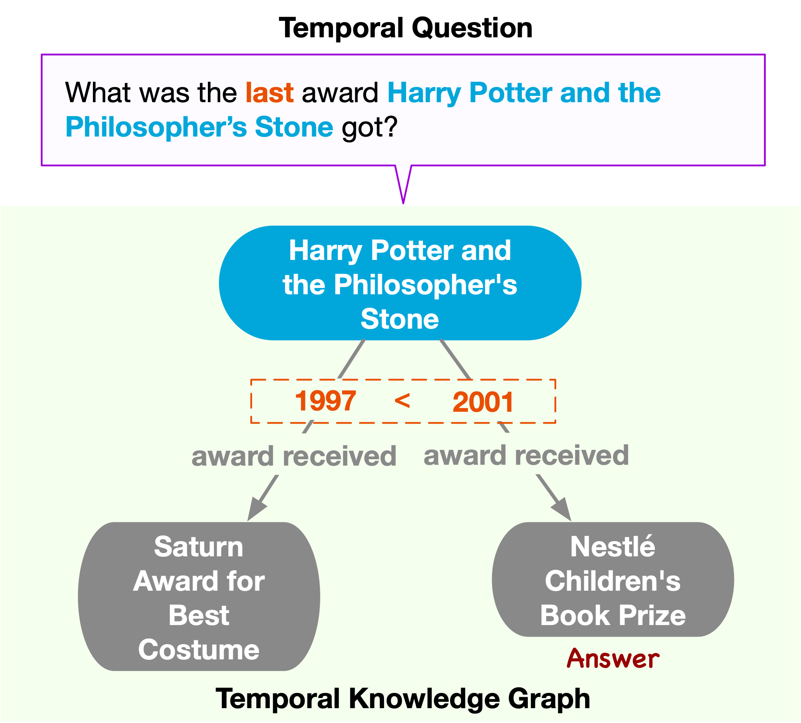

# Temporal Knowledge Graph Question Answering: A Survey

Knowledge Graph Question Answering (KGQA) has been a long-standing field to answer questions based on Knowledge Graphs (KGs). Recently, the evolving nature of knowledge has attracted a growing interest in Temporal Knowledge Graph Question Answering (TKGQA), an emerging task to answer temporal questions based on Temporal Knowledge Graphs (TKGs). However, this field grapples with ambiguities in defining temporal questions and lacks a systematic categorization of existing TKGQA methods. Motivated by this, this paper presents a thorough survey from two perspectives: the taxonomy of temporal questions and the categorization of TKGQA methodologies. Specifically, we first propose a detailed taxonomy of temporal questions explored in prior studies. Subsequently, we provide an in-depth review of TKGQA methodologies of two categories: semantic parsing-based and TKG embedding-based. We explicate advanced solutions as well as techniques used when answering temporal questions. Then, we discuss the potential impact of Large Language Models (LLMs) on TKGQA. Building on the above review, we highlight potential research directions for TKGQA. This work aims to serve as a comprehensive reference for TKGQA and to inspire further research in this area.

    
      
    
<b>Given a temporal question (purple box), the TKGQA
task aims to derive the answer by the underlying temporal
knowledge graph (green box)</b>

**Paper link:** https://arxiv.org/abs/2406.14191

A longer version is coming...

---
🌟 A curated list of resources dedicated to temporal knowledge graph question answering (TKGQA).

## Table of Content

- [🏆 Benchmarks for TKGQA](#-benchmarks-for-tkgqa)

- [📈 Systems for TKGQA](#-systems-for-tkgqa)
  - [🧩 Semantic Parsing-based methods](#-semantic-parsing-based-methods)
  - [🔗 TKG embedding-based methods](#-tkg-embedding-based-methods)
  - [🤖 LLM-based methods](#-llm-based-methods)

## 📊 Benchmarks for TKGQA

- The *Organization* column only records the organization of the first author.

| Date       | Title                                                        | Benchmark             | Organization                              | Code                                                | Leaderboard                                                  |
| ---------- | ------------------------------------------------------------ | --------------------- | ----------------------------------------- | --------------------------------------------------- | ------------------------------------------------------------ |
| 2018/04/23 | [TempQuestions: A Benchmark for Temporal Question Answering](https://dl.acm.org/doi/10.1145/3184558.3191536) | TempoQuestions        | Southwest Jiaotong University             | [Code](https://github.com/zhenjia2017/tequila)      | [Leaderboard](https://paperswithcode.com/sota/question-answering-on-tempquestions) |
| 2022/01/15 | [A Benchmark for Generalizable and Interpretable Temporal Question Answering over Knowledge Bases](https://arxiv.org/abs/2201.05793) | TempoQA-WD            | IBM Research                              | [Code](https://github.com/IBM/tempqa-wd)            | [Leaderboard](https://paperswithcode.com/sota/question-answering-on-tempqa-wd) |
| 2022/09/18 | [Complex Temporal Question Answering on Knowledge Graphs](https://arxiv.org/abs/2109.08935) | TimeQuestions         | Southwest Jiaotong University             | [Code](https://exaqt.mpi-inf.mpg.de/)               | [Leaderboard](https://paperswithcode.com/sota/question-answering-on-timequestions) |
| 2021/06/03 | [Question Answering Over Temporal Knowledge Graphs](https://arxiv.org/abs/2106.01515) | CronQuestions         | Indian Institute of Science Bangalore     | [Code](https://github.com/apoorvumang/CronKGQA)     | [Leaderboard](https://paperswithcode.com/sota/question-answering-on-cronquestions) |
| 2022/09/05 | [Temporal knowledge graph question answering via subgraph reasoning](https://dl.acm.org/doi/10.1016/j.knosys.2022.109134) | Complex-CronQuestions | National University of Defense Technology | [Code](https://github.com/czy1999/SubGTR)           | [Leaderboard](https://paperswithcode.com/sota/question-answering-on-complex-cronquestions) |
| 2023/07/01 | [Multi-granularity Temporal Question Answering over Knowledge Graphs](https://aclanthology.org/2023.acl-long.637.pdf) | MultiTQ               | National University of Defense Technology | [Code](https://github.com/czy1999/MultiTQ)          | [Leaderboard](https://paperswithcode.com/sota/question-answering-on-multitq) |
| 2024/08/01 | [MusTQ: A Temporal Knowledge Graph Question Answering Dataset for Multi-Step Temporal Reasoning](https://aclanthology.org/2024.findings-acl.696.pdf) | MusTQ                 | Soochow University                        |                                                     |                                                              |
| 2022/08/12 | [ForecastTKGQuestions: A Benchmark for Temporal Question Answering and Forecasting over Temporal Knowledge Graphs](https://arxiv.org/abs/2208.06501) | ForecastTKGQuestions  | LMU Muni                                  | [Code](https://github.com/ZifengDing/ForecastTKGQA) | [Leaderboard](https://paperswithcode.com/sota/question-answering-on-timequestions) |
| 2024/02/23 | [Faithful Temporal Question Answering over Heterogeneous Sources](https://arxiv.org/abs/2402.15400) | TIQ                   | Southwest Jiaotong University             | [Code](https://github.com/zhenjia2017/TIQ)          | [Leaderboard](https://faith.mpi-inf.mpg.de/)                 |

## 📈 Systems for TKGQA

- The *Organization* column only records the organization of the first author.

### 🧩 Semantic Parsing-based methods

| Date       | Title                                                        | Organization                  | Code                                           |
| ---------- | ------------------------------------------------------------ | ----------------------------- | ---------------------------------------------- |
| 2018/10/17 | [TEQUILA: Temporal Question Answering over Knowledge Bases](https://arxiv.org/abs/1908.03650) | Southwest Jiaotong University | [Code](https://github.com/zhenjia2017/TEQUILA) |
| 2021/09/27 | [SYGMA: System for Generalizable Modular Question Answering Over Knowledge Bases](https://aclanthology.org/2022.findings-emnlp.284/) | IBM Research                  |                                                |
| 2022       | [Complex Question Answering Over Temporal Knowledge Graphs](https://link.springer.com/chapter/10.1007/978-3-031-20891-1_6) | Guangzhou University          |                                                |
| 2023/12/01 | [Best of Both Worlds: Towards Improving Temporal Knowledge Base Question Answering via Targeted Fact Extraction](https://aclanthology.org/2023.emnlp-main.287/) | IBM Research, India           |                                                |

### 🔗 TKG embedding-based methods

| Date       | Title                                                        | Organization                                     | Code                                            |
| ---------- | ------------------------------------------------------------ | ------------------------------------------------ | ----------------------------------------------- |
| 2021/06/03 | [Question Answering Over Temporal Knowledge Graphs](https://arxiv.org/abs/2106.01515) | Indian Institute of Science Bangalore            | [Code](https://github.com/apoorvumang/CronKGQA) |
| 2022/09/18 | [Complex Temporal Question Answering on Knowledge Graphs](https://arxiv.org/abs/2109.08935) | Southwest Jiaotong University                    | [Code](https://exaqt.mpi-inf.mpg.de/)           |
| 2022/06/28 | [TempoQR: Temporal Question Reasoning over Knowledge Graphs]() | University of Minnesota                          | [Code](https://github.com/cmavro/TempoQR)       |
| 2022/03/01 | [Improving Time Sensitivity for Question Answering over Temporal Knowledge Graphs](https://arxiv.org/abs/2203.00255) | JD AI Research                                   |                                                 |
| 2023/04/01 | [An improving reasoning network for complex question answering over temporal knowledge graphs](https://link.springer.com/article/10.1007/s10489-022-03913-6) | Shandong Jiaotong University                     |                                                 |
| 2022/09/05 | [Temporal knowledge graph question answering via subgraph reasoning](https://dl.acm.org/doi/10.1016/j.knosys.2022.109134) | National University of Defense Technology        | [Code](https://github.com/czy1999/SubGTR)       |
| 2023/      | [TwiRGCN: Temporally Weighted Graph Convolution for Question Answering over Temporal Knowledge Graphs]() | IISc, Bangalore                                  |                                                 |
| 2022/11/24 | [Modeling Temporal-Sensitive Information for Complex Question Answering over Knowledge Graphs]() | Wuhan University School of Computer Science      |                                                 |
| 2023/06    | [Time-aware Multiway Adaptive Fusion Network for Temporal Knowledge Graph Question Answering ](https://arxiv.org/abs/2302.12529) | Tsinghua University                              |                                                 |
| 2023/07/01 | [Multi-granularity Temporal Question Answering over Knowledge Graphs](https://aclanthology.org/2023.acl-long.637.pdf) | National University of Defense Technology        | [Code](https://github.com/czy1999/MultiTQ)      |
| 2023       | [Local and Global: Temporal Question Answering via Information Fusion](https://www.ijcai.org/proceedings/2023/571) | Jilin University                                 |                                                 |
| 2024/01/04 | [JOINT MULTI-FACTS REASONING NETWORK FOR COMPLEX TEMPORAL QUESTION ANSWERING OVER KNOWLEDGE GRAPH](https://arxiv.org/abs/2401.02212) | Huazhong University of Science and Technology    |                                                 |
| 2024/02/02 | [Semantic-enhanced reasoning question answering over temporal knowledge graphs](https://link.springer.com/article/10.1007/s10844-024-00840-5) | Xi’an University of Posts and Telecommunications |                                                 |
| 2024/02/20 | [Question Calibration and Multi-Hop Modeling for Temporal Question Answering](https://arxiv.org/abs/2402.13188) | Beihang University, Beijing                      |                                                 |
| 2024/03/18 | [M 3 TQA: MULTI-VIEW, MULTI-HOP AND MULTI-STAGE REASONING FOR TEMPORAL QUESTION ANSWERING]() | Renmin University of China                       |                                                 |
| 2024/08/01 | [MusTQ: A Temporal Knowledge Graph Question Answering Dataset for Multi-Step Temporal Reasoning](https://aclanthology.org/2024.findings-acl.696.pdf) | Soochow University                               |                                                 |

### 🤖 LLM-based methods

| Date       | Title                                                        | Organization                              | Code                                          |
| ---------- | ------------------------------------------------------------ | ----------------------------------------- | --------------------------------------------- |
| 2024/04/02 | [Self-Improvement Programming for Temporal Knowledge Graph Question Answering]() | Institute of Computing Technology         |                                               |
| 2023/11/15 | [Temporal Knowledge Question Answering via Abstract Reasoning Induction](https://aclanthology.org/2024.acl-long.267.pdf) | National University of Defense Technology | [Code](https://github.com/czy1999/ARI-QA)    |
| 2023/10/20 | [Question Answering as Programming for Solving Time-Sensitive Questions]() | Tsinghua University                       | [Code](https://github.com/TianHongZXY/qaap)   |
| 2024/07/24 | [Two-stage Generative Question Answering on Temporal Knowledge Graph Using Large Language Models](https://arxiv.org/abs/2402.16568) | National University of Defense Technology |                                               |
| 2024/02/23 | [Faithful Temporal Question Answering over Heterogeneous Sources](https://arxiv.org/abs/2402.15400) | Southwest Jiaotong University             | [Code](https://github.com/zhenjia2017/FAITH)  |
| 2024       | [TimeR4 : Time-aware Retrieval-Augmented Large Language Models for Temporal Knowledge Graph Question Answering](https://aclanthology.org/2024.emnlp-main.394.pdf) | Nankai University                         | [Code](https://github.com/qianxinying/TimeR4) |

